# **Movie Talk**

### Movie Talk es una App Web creada por y para amantes de las peliculas, en ella los usuarios podran ver descripciones de las peliculas de su interes y tambien encontrar enlaces directos hacia las diferentes plataformas de streaming (gratuitas y de pago) en donde se encuentren y poder disfrutar de ellas.

## **Historias de usuario**
Para comenzar a desarrollar este proyecto hemos creado un [formulario de google](https://docs.google.com/forms/d/e/1FAIpQLSflyz5dhbJRAtjZyN8NPJifCfHq4KAVOnrymDOpvBlTAao9aA/viewform) con preguntas orientadas a los gustos de los usuarios al momento de acceder a plataformas web orientadas al mundo cinematografico. 

En base a los resultados obtenidos en el formulario comenzamos a desarrollar las historias de usuario y a organizarlas en base a la **metodologia scrum**.

### 1. Historia de usuario 
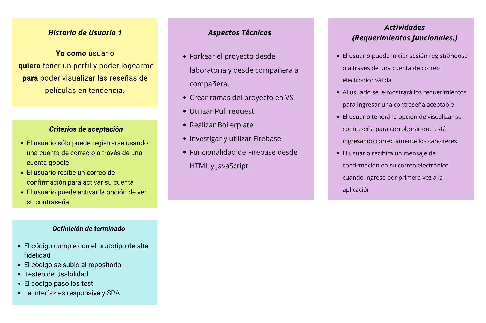
### 2. Historia de usuario
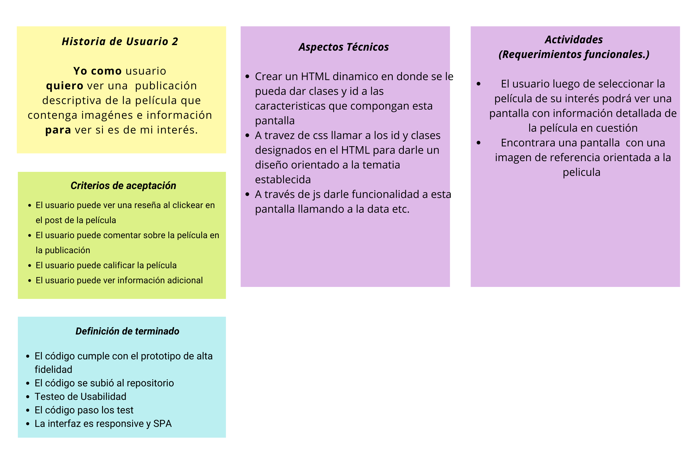
### 3. Historia de usuario
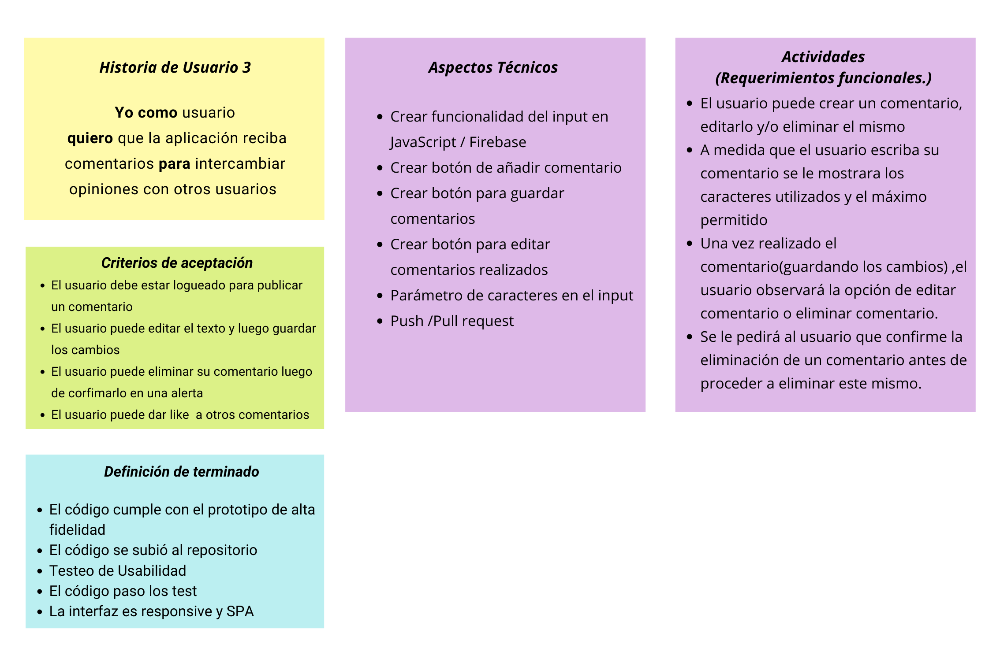
### 4. Historia de usuario
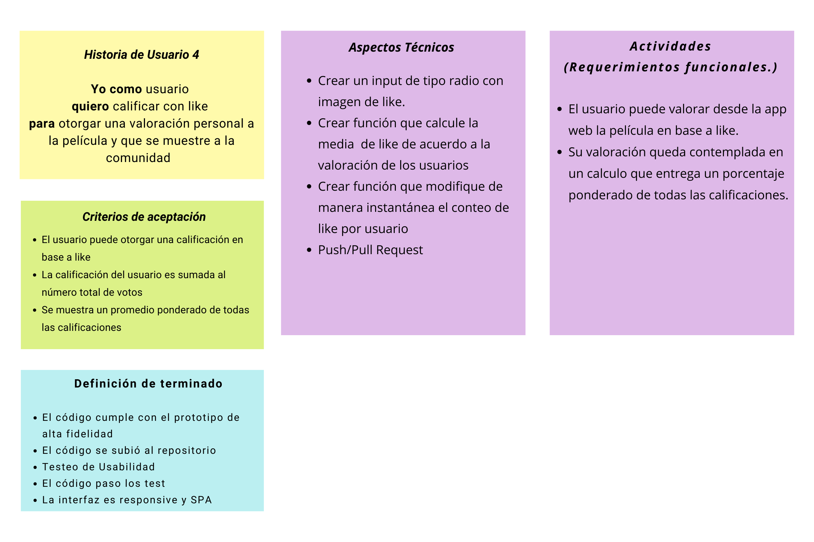
Luego de terminar las historias de usuario comenzamos a maquetar nuestros prototipos de baja fidelidad. 

## **Prototipos de baja fidelidad**
### Prototipos en  pantallas de moviles
1.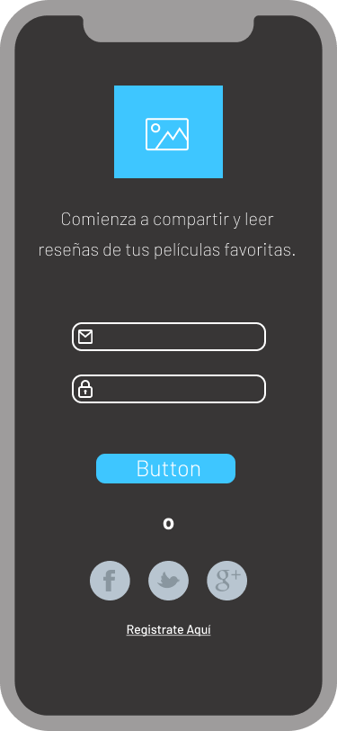 
2.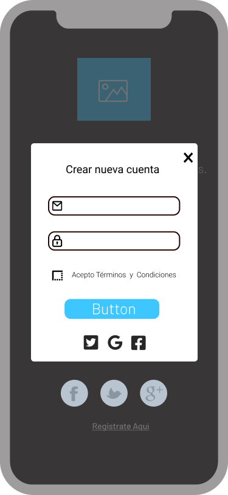 
3.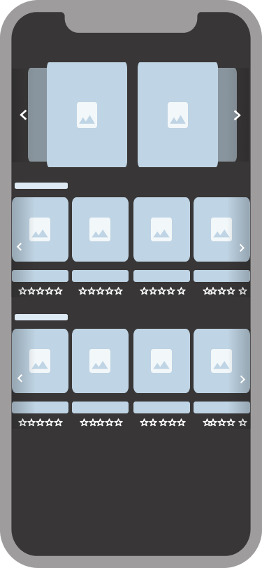 
4. 

### Prototipos en pantallas de computador
1.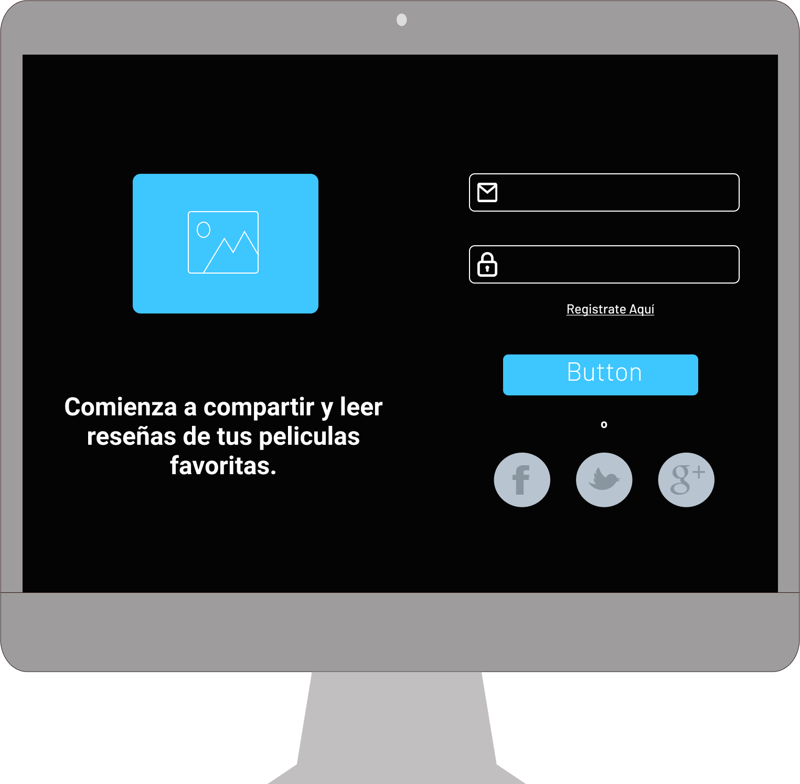 
2.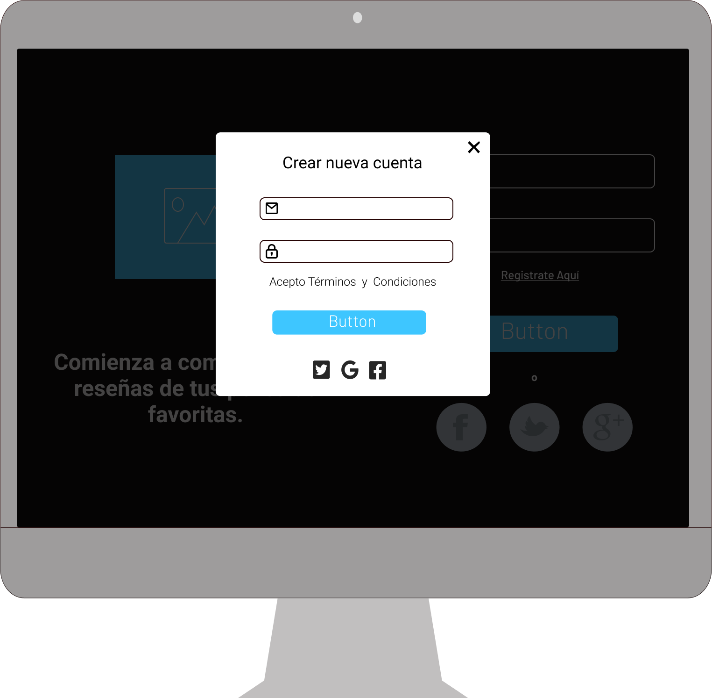 
3.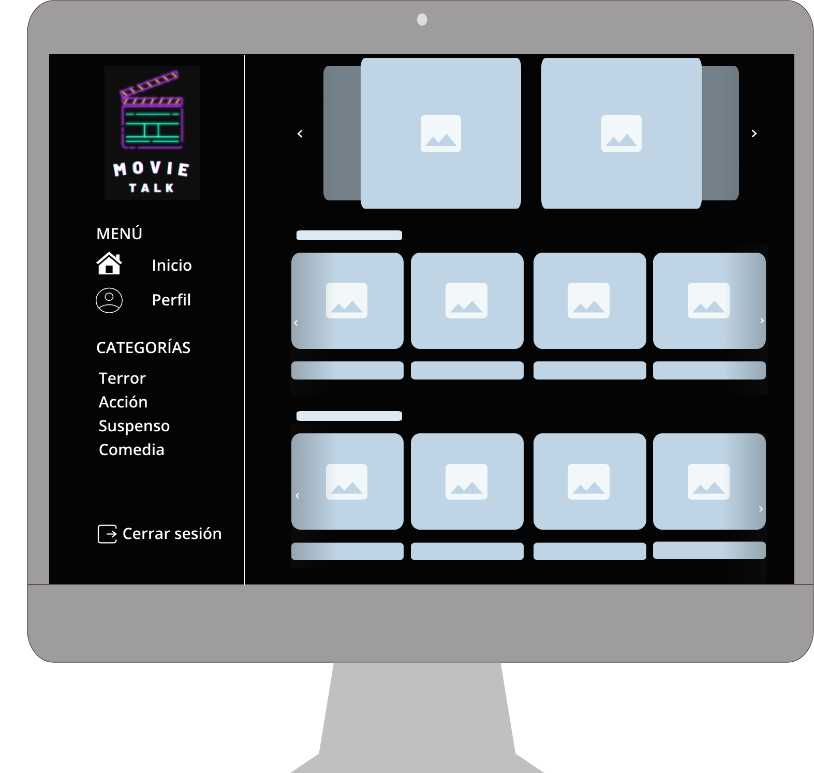 
4.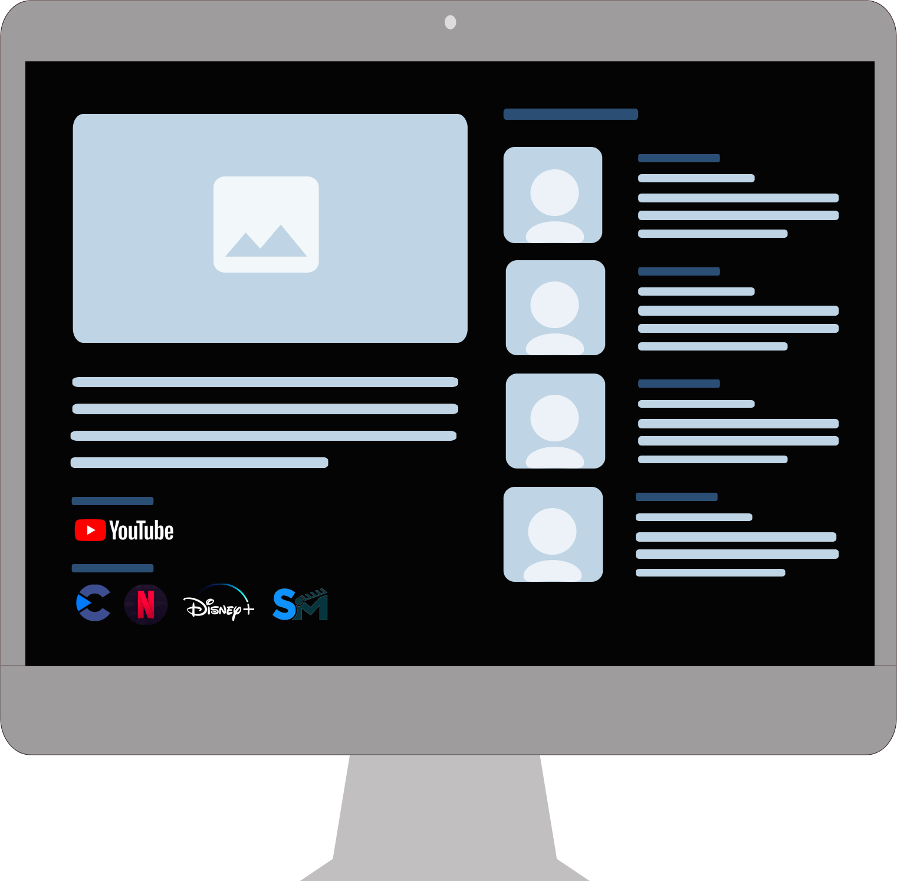 
Luego de crear e iterar nuestros prototipos de baja fidelidad en base a las historias de usuario comenzamos a realizar nuestros prototipos de alta fidelidad presentados a continuación. 

## **Prototipos de alta fidelidad**
### Prototipos en  pantallas de moviles
1.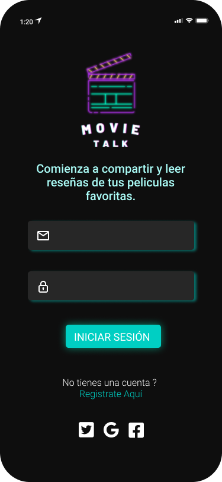 
2.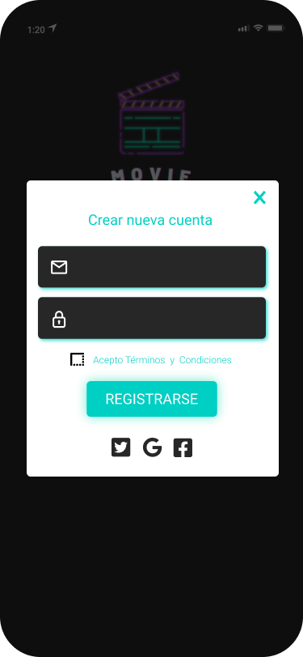 
3.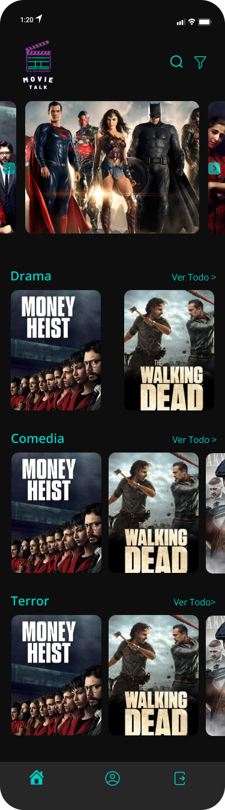 
4.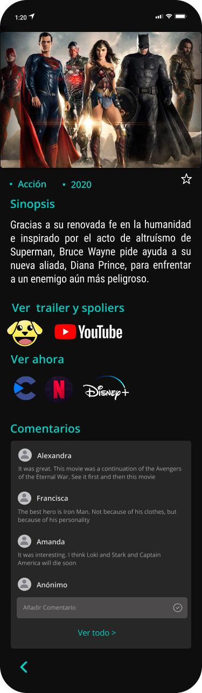 

### Prototipos en pantallas de computador
1. 
2.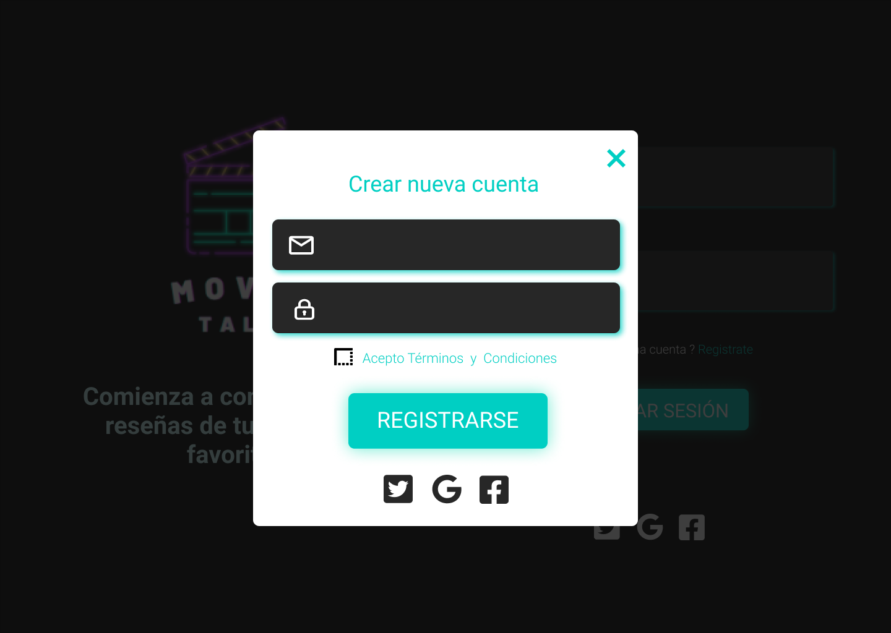 
3. 
4.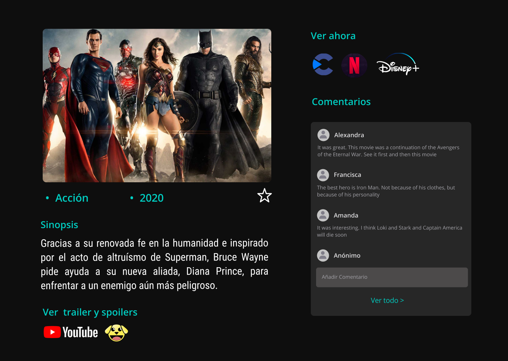 

<!-- ### 5.2 Definición del producto

En el `README.md` cuéntanos brevemente cómo descubriste las necesidades de los
usuarios y cómo llegaste a la definición final de tu producto. Es importante
que detalles:

* Quiénes son los principales usuarios de producto.
* Qué problema resuelve el producto / para qué le servirá a estos usuarios. -->

